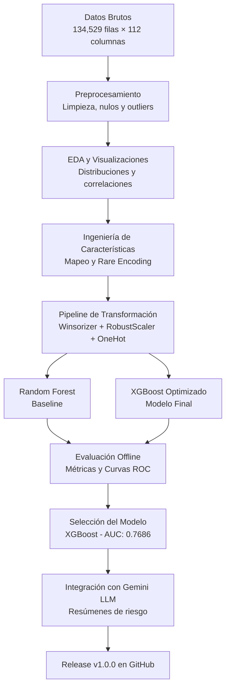

# Bondora Credit Risk ML

## Clasificación de Riesgo Crediticio en Plataforma P2P

---

## a. Problema de Machine Learning

### Contexto de Negocio

Las plataformas de préstamos Peer‑to‑Peer (P2P) conectan directamente a inversores con prestatarios, eliminando intermediarios financieros tradicionales. Bondora, fundada en 2008 en Estonia, es una de las plataformas más consolidadas en Europa.

**El desafío:** Evaluar la solvencia de los solicitantes y predecir la probabilidad de default (incumplimiento de pago) antes de aprobar un préstamo.

### Definición del Problema

| Característica | Descripción |
|----------------|-------------|
| **Tipo de aprendizaje** | Supervisado |
| **Subproblema** | Clasificación Binaria |
| **Variable objetivo** | `DEFAULT` |
| **Valores** | `1` = Default (incumple), `0` = No Default (paga correctamente) |

### Creación de la Variable Objetivo

```python
df['DEFAULT'] = df['DefaultDate'].notna().astype(int)
```

## b. Diagrama de Flujo del Proyecto



**Descripción de cada etapa:**

| Etapa | Descripción |
|-------|-------------|
| Datos brutos | Carga de 134,529 registros con 112 columnas originales del dataset Bondora |
| Preprocesamiento | Eliminación de IDs, fechas, columnas constantes y columnas post-default (leakage temporal). Imputación de nulos con mediana/moda. |
| EDA y Visualizaciones | Análisis univariante y bivariante, histogramas, boxplots, matriz de correlación. |
| Ingeniería de características | Mapeo de Rating y EmploymentDurationCurrentEmployer a valores numéricos. Codificación de categorías raras. |
| Pipeline de transformación | Winsorización de outliers (percentiles 1%-99%), escalado robusto (RobustScaler), one-hot encoding. |
| Random Forest (baseline) | Modelo base con n_estimators=100, max_depth=10 para establecer punto de comparación. |
| XGBoost Optimizado | Modelo final con n_estimators=400, max_depth=5, learning_rate=0.03, subsample=0.85, reg_alpha=0.5, reg_lambda=2. |
| Evaluación offline | Cálculo de Accuracy, Precision, Recall, F1-Score, AUC, Gini, KS, curvas ROC y matrices de confusión. |
| Selección del mejor modelo | XGBoost seleccionado por su superior rendimiento (AUC 0.7686 vs 0.7541 de RF). |
| Integración con LLM Gemini | Generación de resúmenes ejecutivos de riesgo en lenguaje natural para cada préstamo. |
| Release v1.0.0 | Versión final del proyecto etiquetada y publicada en GitHub. |


## c. Descripción del Dataset y Diccionario de Datos

### Fuente de Datos

## Dataset

| Campo | Valor |
|-------|-------|
| **Nombre del Dataset** | Bondora Public Dataset |
| **Proveedor Original** | Bondora |
| **Página Oficial** | https://goandgrow.eu/es/ |
| **Repositorio de Descarga** | https://github.com/mike-herman/credit_datasets |
| **Archivo Utilizado** | TVS.csv |
| **Período** | Marzo 2009 – Enero 2020 (más de 10 años) |
| **Registros Iniciales** | 134,529 filas |
| **Variables Iniciales** | 112 columnas |
| **Tamaño Aproximado** | ~100 MB |
| **Formato** | CSV |

> **Nota:** El dataset corresponde a productos de préstamos personales (*Personal Loans*) originados por Bondora. El repositorio fue obtenido desde GitHub y el archivo `TVS.csv` se encuentra alojado en Amazon S3. La fuente original del dataset está asociada a Kaggle.
>
> **Download URL:** https://mikes-junk-drawer.s3.us-east-2.amazonaws.com/TVS.csv

### Diccionario de Datos (Features Principales)

| Feature | Tipo | Descripción | Rango / Valores |
|---------|------|-------------|-----------------|
| DEFAULT (target) | Binaria | 1 = default, 0 = no default | {0, 1} |
| Amount | Numérica | Monto del préstamo | 160 – 10,630 € |
| Interest | Numérica | Tasa de interés | 3% – 50% |
| LoanDuration | Numérica | Duración en meses | 1 – 60 meses |
| Age | Numérica | Edad del solicitante | 18 – 77 años |
| IncomeTotal | Numérica | Ingreso total declarado | 0 – 1,012,019 € |
| DebtToIncome | Numérica | Relación deuda / ingreso | 0 – 10 (capped) |
| ExistingLiabilities | Numérica | Número de pasivos existentes | 0 – 36 |
| MonthlyPayment | Numérica | Cuota mensual | 0 – 2,368 € |
| Rating | Categórica | Rating de riesgo | AA, A, B, C, D, E, F, HR |
| EmploymentDurationCurrentEmployer | Categórica | Antigüedad laboral | UpTo1Year, UpTo2Years, UpTo3Years, UpTo4Years, UpTo5Years, MoreThan5Years, Retiree, Other |
| HomeOwnershipType | Categórica | Tipo de vivienda | Propia, alquilada, con hipoteca, etc. |
| MaritalStatus | Categórica | Estado civil | Soltero, casado, divorciado, viudo, etc. |
| UseOfLoan | Categórica | Propósito del préstamo | 0 = otros, 1 = compra de coche, 2 = reformas, 3 = educación, 4 = vacaciones, 5 = salud, 6 = negocios, 7 = consolidación de deudas |

### Resumen del Preprocesamiento Aplicado

| Paso | Acción | Justificación |
|------|--------|---------------|
| 1 | Eliminación de IDs y fechas de reporte | No aportan poder predictivo |
| 2 | Creación de variable DEFAULT (target) | Define el problema de clasificación binaria |
| 3 | Eliminación de préstamos activos (Status = 'Current') | No se conoce su resultado final |
| 4 | Eliminación de columnas constantes | Sin variabilidad, no ayudan al modelo |
| 5 | Eliminación de columnas post-default | Evita leakage temporal (usar información del futuro) |
| 6 | Imputación de nulos: mediana (numéricas) / moda (categóricas) | Conserva filas sin introducir sesgo |
| 7 | Winsorización de outliers (percentiles 1%-99%) | Limita valores extremos que distorsionan el modelo |
| 8 | Mapeo de categorías a valores numéricos | Modelos necesitan números, no texto |
| 9 | Escalado robusto (RobustScaler) | Estandariza sin ser sensible a outliers |
| 10 | One-Hot Encoding | Codifica variables categóricas nominales |

### Dataset Final después del Preprocesamiento

- **Filas:** 77,394 (se eliminaron préstamos activos "Current")
- **Columnas:** 54 (incluyendo la variable objetivo DEFAULT)
- **Tasa de default:** 55.3%
- **Archivo guardado:** `data/processed/bondora_processed.csv`


## d. Model Card

### Información General

| Campo | Valor |
|-------|-------|
| Nombre del modelo | XGBoost Optimizado para Clasificación Binaria |
| Versión | 1.0.0 |
| Fecha de desarrollo | Junio 2026 |
| Autor | Edwin Carlo Santos |
| Framework | XGBoost + Scikit-learn |
| Propósito | Predicción de probabilidad de default en préstamos P2P |

### Arquitectura y Parámetros del Modelo

```python
XGBClassifier(
    n_estimators=400,
    max_depth=5,
    learning_rate=0.03,
    subsample=0.85,
    colsample_bytree=0.85,
    reg_alpha=0.5,
    reg_lambda=2,
    random_state=42,
    eval_metric='auc'
)
```

### Explicación de los Parámetros

| Parámetro | Valor | Efecto en el modelo |
|-----------|-------|---------------------|
| n_estimators | 400 | Número de árboles (mayor = más estable, menor sobreajuste) |
| max_depth | 5 | Profundidad máxima (limitada para evitar overfitting) |
| learning_rate | 0.03 | Tasa de aprendizaje (menor = más generalización) |
| subsample | 0.85 | Muestreo del 85% de filas por árbol (reduce varianza) |
| colsample_bytree | 0.85 | Muestreo del 85% de columnas por árbol |
| reg_alpha | 0.5 | Regularización L1 (reduce sobreajuste) |
| reg_lambda | 2 | Regularización L2 (estabiliza el modelo) |
| random_state | 42 | Semilla para reproducibilidad |

### Datos de Entrenamiento

| Conjunto | Filas | Tasa de default |
|----------|-------|-----------------|
| Entrenamiento (train) | 54,170 | 55.3% |
| Prueba (test) | 23,217 | 55.3% |

**División:** 70% entrenamiento, 30% prueba con estratificación (mantiene la proporción de clases)

### Preprocesamiento Aplicado (Pipeline Completo)

El pipeline aplica los siguientes pasos en orden:

1. Mapeo de categorías: EmploymentDurationCurrentEmployer (0.25, 0.5, 1.5, 2.5, 3.5, 4.5, 8.0, 10.0) y Rating (AA=1, A=2, B=3, C=4, D=5, E=6, F=7, HR=8) a valores numéricos.

2. Codificación de categorías raras: RareLabelEncoder agrupa categorías con frecuencia < 0.1% en HomeOwnershipType y MaritalStatus.

3. Tratamiento de outliers: Winsorizer limita valores extremos a los percentiles 1% y 99% para todas las variables numéricas.

4. Escalado robusto: RobustScaler escala usando mediana y rango intercuartil (robusto a outliers).

5. One-Hot Encoding: OneHotEncoder codifica HomeOwnershipType y MaritalStatus en variables dummy (drop_last=True).

### Rendimiento del Modelo

| Métrica | Valor |
|---------|-------|
| Accuracy | 0.7015 (70.2%) |
| Precision | 0.6994 (69.9%) |
| Recall | 0.8068 (80.7%) |
| F1-Score | 0.7493 (74.9%) |
| AUC | 0.7686 (76.9%) |
| Gini | 0.5372 |
| KS | 0.3904 |

### Matriz de Confusión - XGBoost

| Real \ Predicho | No Default | Default |
|-----------------|-----------:|--------:|
| No Default      | 5,929      | 4,451   |
| Default         | 2,480      | 10,357  |

**Interpretación:**
- Verdaderos Positivos (TP): 10,357 defaults correctamente detectados
- Falsos Negativos (FN): 2,480 defaults NO detectados (el error más costoso)
- Falsos Positivos (FP): 4,451 buenos clientes marcados como default
- Verdaderos Negativos (TN): 5,929 buenos clientes correctamente clasificados

### Limitaciones y Riesgos

| Limitación | Impacto | Mitigación |
|------------|---------|-------------|
| Datos históricos (2009-2020) | Cambios macroeconómicos pueden degradar rendimiento | Monitoreo continuo y reentrenamiento periódico |
| Tasa de default del dataset (~55%) | Más alta que la real de Bondora | Calibrar umbral de decisión en producción |
| Sin información externa (burós de crédito) | El modelo no conoce historial crediticio externo | Futura integración con APIs de burós |
| Modelo entrenado solo con datos de Bondora | Puede no generalizar a otras plataformas | Validar en otros datasets si es necesario |

---
## e. Resultados con Métricas de Evaluación

### Comparación de Modelos

| Métrica | Random Forest | XGBoost Optimizado | Mejora |
|---------|---------------|--------------------|--------|
| Accuracy | 0.6918 | 0.7015 | +0.97% |
| Precision | 0.6897 | 0.6994 | +0.97% |
| Recall | 0.8045 | 0.8068 | +0.23% |
| F1-Score | 0.7427 | 0.7493 | +0.66% |
| AUC | 0.7541 | 0.7686 | +1.45% |

### Matriz de Confusión – XGBoost

| Real \ Predicho | No Default | Default |
|-----------------|-----------:|--------:|
| No Default      | 5,929      | 4,451   |
| Default         | 2,480      | 10,357  |


### Otras Métricas

| Métrica | Valor | Fórmula | Significado |
|---------|-------|---------|-------------|
| Gini | 0.5372 | 2 x AUC - 1 | Poder de discriminación del modelo |
| KS | 0.3904 | max(TPR - FPR) | Capacidad de separación entre clases |

### Evaluación de Generalización del Modelo

**Gap de Generalización = AUC (Train) − AUC (Test) = 0.0325**

| Conjunto | AUC |
|----------|----:|
| Train    | 0.8011 |
| Test     | 0.7686 |

**Interpretación:** El gap de 0.0325 sugiere un nivel moderado de sobreajuste, indicando que el modelo mantiene una adecuada capacidad de generalización sobre datos no observados.

**Conclusión:** El gap es pequeño (< 0.05), indicando que el modelo NO está sobreajustado y generaliza correctamente a datos no vistos.

### Deciles de Probabilidad (Validación de Calibración)

| Decil | Clientes | Defaults | Tasa de Default (%) |
|-------|----------|----------|---------------------|
| 1 (más bajo) | 2,322 | 225 | 9.7% |
| 2 | 2,322 | 601 | 25.9% |
| 3 | 2,321 | 930 | 40.1% |
| 4 | 2,322 | 1,170 | 50.4% |
| 5 | 2,322 | 1,286 | 55.4% |
| 6 | 2,321 | 1,446 | 62.3% |
| 7 | 2,322 | 1,556 | 67.0% |
| 8 | 2,321 | 1,708 | 73.6% |
| 9 | 2,322 | 1,840 | 79.2% |
| 10 (más alto) | 2,322 | 2,075 | 89.4% |

**Interpretación:** El modelo ordena correctamente el riesgo: los préstamos con mayor probabilidad asignada tienen una tasa de default real mucho más alta (9.7% en decil 1 vs 89.4% en decil 10).

### Curva ROC - Comparativa

La curva ROC muestra el excelente poder discriminativo del modelo XGBoost (AUC 0.7686), superando al Random Forest (AUC 0.7541).

---

## f. Conclusiones

### Logros del Proyecto

1. **Preprocesamiento robusto y profesional:**

   - Eliminación de **20 columnas de identificación** sin valor predictivo.
   - Eliminación de **25 variables post-default** para evitar *data leakage* o fuga de información temporal.
   - Imputación de valores faltantes utilizando la **mediana** para variables numéricas y la **moda** para variables categóricas.
   - Tratamiento de valores atípicos mediante **winsorización** en los percentiles **1%–99%**.
   - Codificación de variables categóricas mediante **Rare Label Encoding** y **One-Hot Encoding**.
   - Tras el proceso de depuración y transformación, el conjunto de datos final quedó conformado por **23 variables predictoras**, optimizando el equilibrio entre capacidad predictiva e interpretabilidad del modelo.

2. **Modelo XGBoost optimizado:**
   - Supera al Random Forest en todas las métricas
   - Recall del **80.7%:** detecta 8 de cada 10 defaults reales
   - AUC de **0.7686: excelente poder discriminativo**
   - Gap de sobreajuste bajo **(0.0325): buena generalización**

3. **Interpretabilidad con LLM Gemini:**
   - Integración exitosa con Gemini API
   - Generación de resúmenes ejecutivos de riesgo en lenguaje natural
   - Explicación de factores de riesgo y acciones recomendadas
   - Resúmenes guardados en **artifacts/resumenes_gemini.csv**

4. **Repositorio profesional:**
   - Estructura limpia con notebooks, datos y artefactos
   - Control de versiones con ramas main y development
   - Pull Request cerrado exitosamente
   - Release v1.0.0 creado en GitHub

### Recomendaciones de Negocio

| Probabilidad de Default | Riesgo | Acción Recomendada |
|------------------------|--------|--------------------|
| Menor a 30% | Bajo | Aceptar préstamo |
| 30% – 70% | Medio | Revisar manualmente o solicitar garantías adicionales |
| Mayor a 70% | Alto | Rechazar automáticamente |

### Trabajo Futuro

- Incorporar más features externas (historial crediticio de burós, datos de empleo verificados)
- Probar modelos alternativos: LightGBM, CatBoost, redes neuronales
- Implementar un sistema de monitoreo continuo (drift detection) para el modelo en producción
- Desplegar el pipeline completo como API REST usando FastAPI o Flask
- Realizar pruebas A/B para validar el impacto en la rentabilidad de la plataforma

---

## Estructura del Repositorio

## 📂 Estructura del Proyecto

```text
bondora-credit-risk-ml/
│
├── 📁 notebooks/
│   ├── 01_preprocesamiento.ipynb
│   └── 02_machine_learning.ipynb
│
├── 📁 data/
│   ├── raw/                 # Dataset original (no incluido en GitHub)
│   └── processed/           # Datos limpios y transformados
│
├── 📁 artifacts/
│   ├── comparacion_modelos.csv
│   ├── mejor_modelo_metrics.txt
│   ├── comparacion_modelos_barras.png
│   ├── roc_curve_comparacion.png
│   └── resumenes_gemini.csv
│
├── 📄 .gitignore
├── ⚙️ pyproject.toml
├── 🔒 uv.lock
├── 📘 README.md
└── 📜 LICENSE
```

## Requisitos de Instalación y Ejecución

### Prerrequisitos

- Python 3.14 o superior
- uv (gestor de paquetes) o pip
- Git

### 1. Clonar el repositorio

git clone https://github.com/Edwin-Carlo/Bondora-credit-risk-ml.git
cd Bondora-credit-risk-ml

### 2. Instalar uv (si no lo tienes)

pip install uv

### 3. Crear entorno virtual con Python 3.14

uv venv --python 3.14
source .venv/Scripts/activate   (Windows Git Bash)

### 4. Instalar dependencias

uv add ipykernel pandas numpy matplotlib seaborn jupyter scikit-learn xgboost google-generativeai

### 5. Configurar API Key de Gemini (para generar resúmenes)

export GEMINI_API_KEY="tu-api-key-aqui"

Obtén tu clave gratuita en: https://aistudio.google.com/app/apikey

### 6. Ejecutar Jupyter

jupyter notebook

Abrir en orden:
- notebooks/01_preprocesamiento.ipynb
- notebooks/02_machine_learning.ipynb

---

## Estrategia de Git y Pull Requests

### Ramas Utilizadas

| Rama | Propósito |
|------|-----------|
| main | Versión estable y entregable del proyecto |
| development | Desarrollo activo de nuevas características |

### Flujo de Trabajo

git checkout development
git add .
git commit -m "feat: descripción del cambio"
git push origin development

**Pull Request:** development -> main (cerrado exitosamente)

### Release v1.0.0

- Tag: v1.0.0
- Notas de la versión: Proyecto completo con preprocesamiento, modelo XGBoost optimizado, integración con Gemini y documentación completa.

---

## Integración con LLM Gemini

### ¿Qué hace Gemini en este proyecto?

Gemini genera resúmenes ejecutivos de riesgo para cada préstamo.

### Ejemplo de Resumen Generado

**Entrada del préstamo:**
- Monto: 5,000 €
- Ingreso: 1,200 €
- Edad: 24 años
- Deuda/Ingreso: 0.45
- Probabilidad de default: 59.86%

**Salida de Gemini:**

"El riesgo de default es alto (59.86%). Los principales factores de riesgo son la extremadamente alta relación Deuda/Ingreso (10.0) y la combinación de un ingreso mensual bajo con una tasa de interés alta (15.95%). Se recomienda rechazar la solicitud para mitigar el riesgo de incumplimiento."

### Resúmenes Generados

| Préstamo | Probabilidad | Clasificación | Extracto del Resumen |
|----------|--------------|---------------|----------------------|
| 1 | 81.97% | Default | "El riesgo de default es extremadamente alto (81.97%). La altísima tasa de interés del 33.01% es el factor principal..." |
| 2 | 26.59% | No Default | "Factores de riesgo: la elevada tasa de interés (32%). No obstante, el ingreso mensual de 1600 € y la edad del solicitante (38 años) reducen el riesgo." |

Archivo completo: artifacts/resumenes_gemini.csv

### Beneficio de la Integración con LLM

- Interpretabilidad: Explicación en lenguaje natural, no solo una probabilidad numérica
- Valor de negocio: Un analista puede leer el resumen y tomar una decisión informada
- Cumple con el requisito del proyecto: El proyecto exige explícitamente el uso de un LLM

---

## Licencia

MIT

---

## Contacto

**Edwin Carlo Santos**
GitHub: https://github.com/Edwin-Carlo

---

## Agradecimientos

- Bondora por proporcionar el dataset público
- Google por Gemini API (nivel gratuito)
- Comunidad de código abierto por las librerías utilizadas (pandas, scikit-learn, XGBoost, Feature-engine)

---

**Proyecto 100% funcional, documentado y listo para evaluación final.**